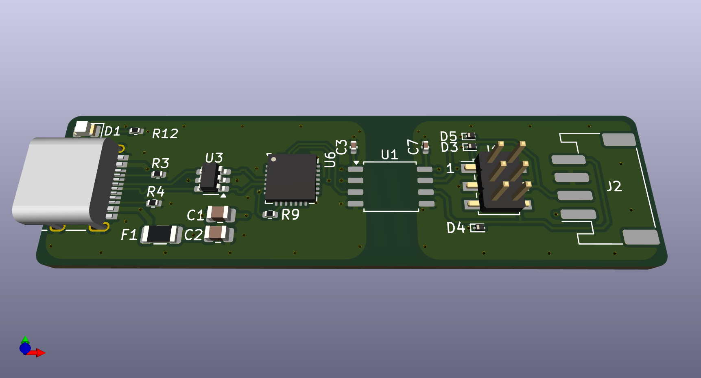

# usb-serial-ttl
Isolated USB to serial adapter, TTL 3.3V level. The 3.3V needs to be supplied
from the host.

Uses KiCad 8.0 and [kicad-jlcpcb-tools](https://github.com/Bouni/kicad-jlcpcb-tools) plugin for creating fabrication files.
